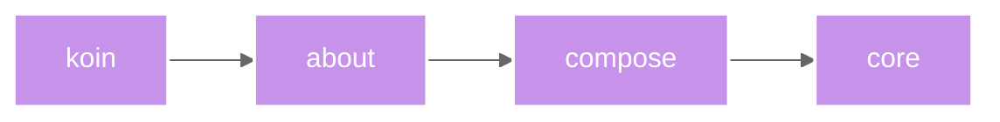

### Modules

```mermaid
%%{
  init: {
    'theme': 'neutral'
  }
}%%

graph LR
  :about["about"]
  :compose["compose"]
  :compose["compose"]
  :core["core"]
  :koin["koin"]
  :about["about"]

  :about --> :compose
  :compose --> :core
  :koin --> :about

classDef kotlin-multiplatform fill:#C792EA,stroke:#fff,stroke-width:2px,color:#fff;
class :about kotlin-multiplatform
class :compose kotlin-multiplatform
class :core kotlin-multiplatform
class :koin kotlin-multiplatform

```